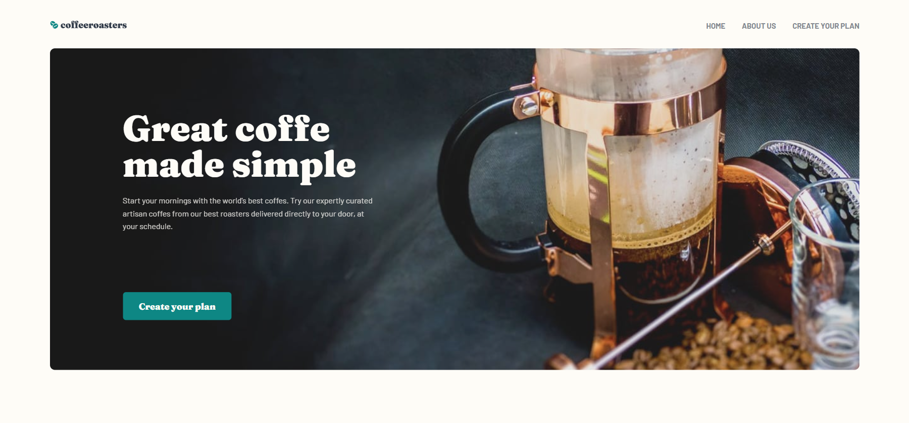
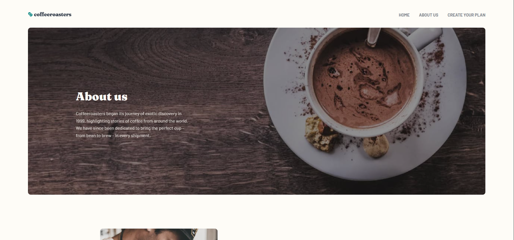
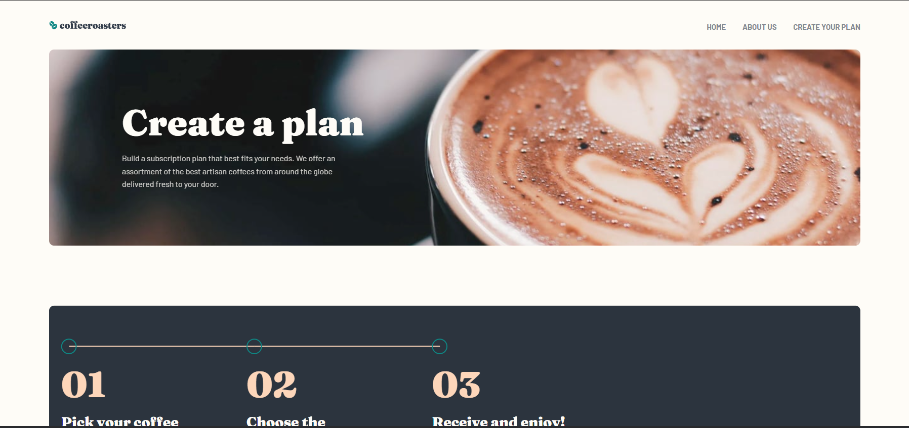
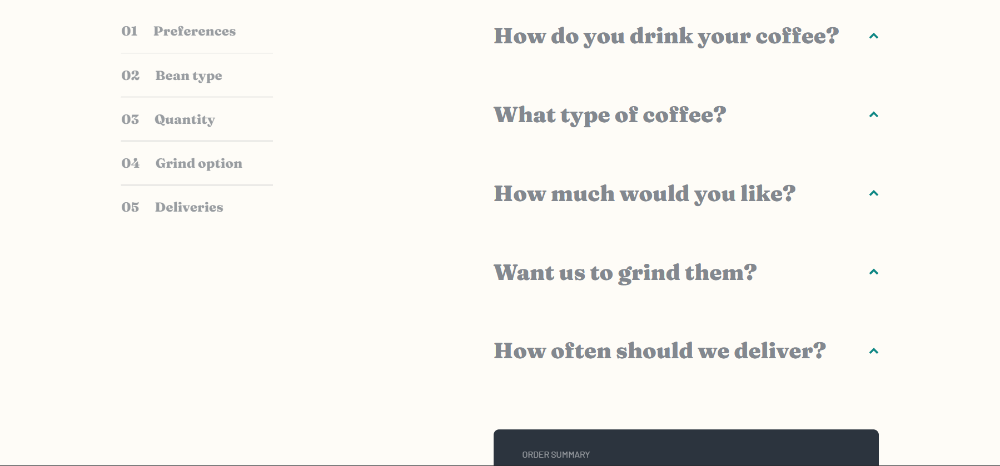

# Frontend Mentor - Coffeeroasters subscription site solution

This is a solution to the [Coffeeroasters subscription site challenge on Frontend Mentor](https://www.frontendmentor.io/challenges/coffeeroasters-subscription-site-5Fc26HVY6). 

This app is to create a coffee subscription based on selections.

## Table of contents

- [Overview](#overview)
  - [The challenge](#the-challenge)
  - [Screenshot](#screenshot)
  - [Links](#links)
- [My process](#my-process)
  - [Built with](#built-with)
  - [What I learned](#what-i-learned)
  - [Continued development](#continued-development)
  - [Useful resources](#useful-resources)
- [Author](#author)

**Note: Delete this note and update the table of contents based on what sections you keep.**

## Overview

### The challenge

You as the User should be able to:

- View the optimal layout for each page depending on their device's screen size
- See hover states for all interactive elements throughout the site
- Make selections to create a coffee subscription and see an order summary modal of your choices

### Screenshot

-Home-page

-About-page

-Plan-page

-Subscription-section


### Links

- Solution URL: [Github](https://github.com/mateszucs96/coffeeroasters-subscription-site)
- Live Site URL: [Live](https://coffesubscription.netlify.app)

## My process

### Built with

- Semantic HTML5 markup
- Sass variables
- Flexbox
- CSS Grid
- Mobile-first workflow
- [Sass](https://sass-lang.com/)

### What I learned

I Mainly focused on sass, responsive layout and the "mobile-first" pattern and this challenge was perfect for it. 
Learnt to use sass and the importance of it. Especially mixins and separate sass files.
Also learnt to use the picture tag so don't have to use media-queries and it won't download all options just the needed ones,
and svg tag to be able to fill svg-images via css.
On the other hand I'm still in the learning process of Javascript Classes, maybe it wasn't the best choice to do the challenge with it, but at least i can practice. 

```html
<svg class="footer__logo">
  <use xlink:href="./assets/sprite.svg#logo"></use>
</svg>
```
```html
<picture class="about-quality__heading">
  <source media="(min-width:760px) and (max-width:1280px)" srcset="./assets/about/tablet/image-quality.jpg">
  <source media="(min-width:1280px)" srcset="./assets/about/desktop/image-quality.jpg">
  
</picture>
```
```css
@mixin flex-content($direction: null, $justify: null, $align: null) {
  display: flex;
  flex-direction: $direction;
  align-items: $align;
  justify-content: $justify;
}
```
```css
@mixin center-content($margin-top: 0, $border-radius: 0rem) {
    width: 89%;
    margin: $margin-top auto;
    border-radius: $border-radius;
}
```

### Continued development
I still want to learn more deeply JS classes, and move to a JS framework, especially React.
Also want to learn git more because it is a great and very useful tool for version control.
And of course the deep sass knowledge, mainly in animations are missing, but i'm working on it.


### Useful resources

- [Jonas Schmedtman css and sass course on Udemy](https://www.udemy.com/course/advanced-css-and-sass/) - This  really helped me for learn sass and animations.
- [The good, old MDN](https://developer.mozilla.org/en-US/) - It's still one of the best documentation.

## Author

- Frontend Mentor - [@mateszucs96](https://www.frontendmentor.io/profile/mateszucs96)